# Simple Multithreaded Raytracer

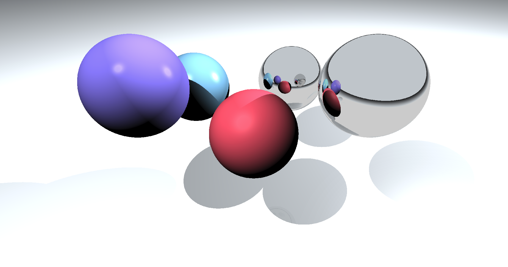

## Usage

### Dependencies:
- G++ (GCC)
- POSIX Environment (for POSIX threads)

You can compile and run it using the `run.sh` file. When the program runs, it creates a `out.ppm` image
which is the rendered image.
Currently this program is not very user-friendly. You have to get into the code and put all the objects yourself.

<h1>Internals</h1>

This simple ray-tracer can be quite educational I think and a good introduction to graphics (and maybe a little
bit to performance programming). I will continue with a small description of its internals. I assume
some math background like: coordinate systems / spaces, linear and quadratic equation solving, vector operations etc.

**Warning**: I think that visualizing the things that I'll describe is very important for a good understanding.
For this reason, I will use some drawings of mine which are very bad (drawing with a mouse is not that effective).
Nonetheless, I hope they will be good enough to help you create a mental image.

## Overview

We start by putting a camera into the world from which we see the world.
We also put a film in front of the camera and shoot rays _from_ the camera
origin _to_ different film points.

These film points are not random. The film represents the resulting image and so, we'll consider one point per
pixel.

Then for every ray, we'll check if it hit something in the world. If it did, then we'll the set the color
of this pixel to the color of the object it hit, otherwise we'll set it to the default color of the world.

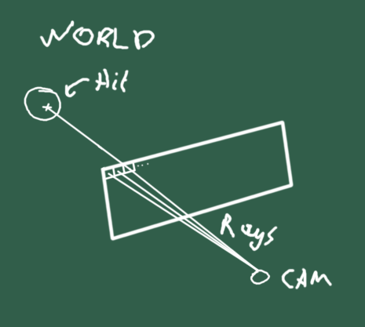

This was a **high-level overview** of how the program works. Now, we'll get to details.

## The coordinate system

I should mention that the coordinate systems used are left-handed. Informally, +x is to the right,
+y to the top and +z to the front.

## The camera

The camera defines its own coordinate space (which is also our view of the world).
The camera "looks" from its origin and to the "front", which,
because we use a left-handed coordinate system, is its +z axis.
The camera has an origin. Then, its coordinate space is defined with a +z axis "looking" always at
the center of the world, hence this line of code:
```
camera.z_axis = normalize(-camera.origin);
```

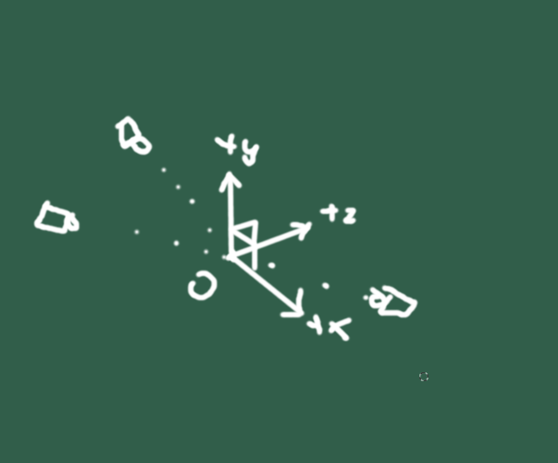

Then, we do some standard stuff to create the other 2 axes.

## The Film

### The Field of View
First of all, there's something called the **field of view** (FOV). This is the distance of the film
from the camera origin. In our case, it influences how "zoomed" the objects will appear.

To understand that, image that our world has only one ball at its center. Look at the cases below.

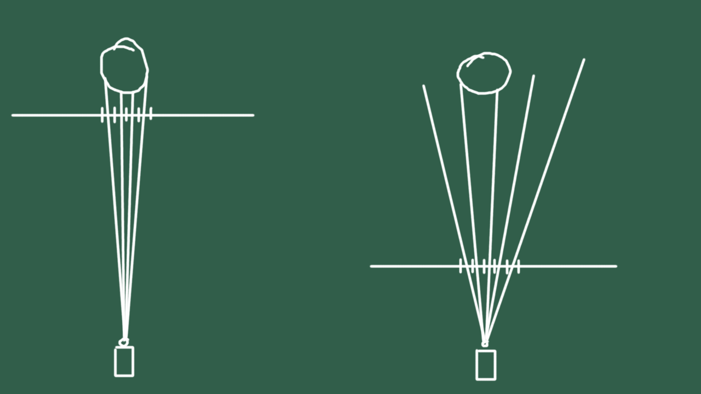

Consider that these are 2 worlds viewed from above. The horizontal lines are the films which in both cases
have the same width and height. The vertical lines crossing them are the pixel width which is also the same
in both cases. Lastly, in both cases, the camera and the ball are in the same place
(so, their distance is also the same). The only thing changing is the distance of the film from the camera,
so the field of view.

Notice that in the left case, the film has been placed very close to the ball, which makes the ball appear
big because way more rays hit it (notice that the angle from one ray to the next is increasing slowly).

In the right case though, few rays hit the ball because the film is very far from the ball or more importantly,
very close to the camera. This results in the camera seeing a bigger part of the world (which in turn means it
catches a smaller part of the ball).

### The Film Width and Height

Assume for a second that our images are square. We make the film width and height `2.0f` because it just
makes the math easy. You just move from -1.0 to 1.0f in the x-axis (left to right)
and 1.0f to -1.0f (top to bottom) in y-axis. We just move accordingly always having as a reference
the film center and always moving in the camera coordinate space. That's why you see the dot products
with `camera.x_axis` and `camera.y_axis`.

Lastly, if our images are not square, we just do a small aspect ration computation by always keeping 2.0f
as the maximum width and "shrinking" in the small direction. For example, if width is double the height,
then `half_film_width = 1.0f` and `half_film_height = 0.5f`.

## Shooting rays
A ray has an origin and a direction. The origin is simple, it is the camera origin. The direction is also
simple. It it the vector _from_ its origin _to_ the film point. We then call `cast_ray()` in which we pass
a ray and the world. This function will cast the ray to the world and it will return us back a color.

### Casting a ray into the world

We could divide this in 2 steps:
* Check if it intersects with anything.
* If it does, apply light info.

The first step is accomplished by `intersect_ray_with_world()`. It returns us back some info, which are:
* Whether it intersected anything.
* The intersection point.
* The normal of the surface.
* The material.

It does that by looping over all the objects in the world and checking if it intersects with any of those.
Since our only actual objects are only planes and spheres, it has only 2 loops.
Before we move on to see how do we check the actual intersection, let's note 2 things:
- A ray might intersect with multiple objects. The 2 functions that check for intersection with plane and sphere
both return us an intersection distance (the distance from the ray origin to the intersection point).
It's important that we consider only the minimum distance intersection because that the object which
is closer to the camera (and such, the one we should "see").
- As we'll see below, the 2 functions that check for intersection, handle the ray as a line rather than as err.. a ray.
That is because a ray is a 1-dimensional halfspace(It's the half part of a line - which is 1-dimensional - split in 2
(by a point which is 0-dimensional)) and the math are difficult. By handling it as a line they're way easier
but they have one caveat. A line can intersect something which is "behind", because well.. it's a line and it
extends in both directions. For that reason, we only consider intersection distances that are positive.

### Intersection of a line with a plane

The plane has equation: `inner(n, p) = d;`

`n`: The plane normal  
`d`: Distance from the origin.

All the points `p` that satisfy this equation belong to the plane.

Treating the ray as a line, its equation is: `y = o + xd` where `o` is the origin, `d` the direction and `x`
a variable. The line consists of all the points `y` as `x` ranges over all possible values.
Note: `x` is a measure in length units (whatever the units
are, e.g. meters). If we plug a specific `x`, that means that the point we'll
get is `x` units _away_ from the origin `o`.

We'll plug the line equation into the plane equation: `inner(n, o + xd) = 0`.
That is, we'll try to see if there's any point in the line that belongs to the
plane. To do that, we'll solve for `x`.

Notice that the denominator might be zero in which case the value is undefined
and we have to return a default given value.

### Intersection of a line with a sphere

The idea is the same as with the plane except that the sphere has a quadratic equation,
so the math are slightly more difficult.
The equation for a sphere is: `(t - c)^2 = r^2` where `c` is the sphere
center and `r` its radius. We plug the line equation
in the place of `t` and we solve for the `x`. Only this time,
the equation is a quadratic one, so we want to transform it in the form:
ax^2 + bx + c = 0 and solve as usual for quadratic equations.

Note that a sphere, contrary to the plane, can have 0, 1 or **2** intersection points with a line:


Again, we just consider the closest one.

#### A word about floating-point numerical errors
Computer math have numerical errors of different sorts that we have to account for, that's why
you see for example the `float_is_zero()` function instead of just checking for equality with `0.0f`.

---

At this point, you should be able to get images like this:


Not photo-realistic exactly, but to me it was very interesting that I made a program do that
(be sure to play around - move spheres and planes around etc. - before moving on).

## Lighting

Lighting is a very complex phenomenon for multiple reasons and I don't pretend to know very much about it either.
But we can learn some basic stuff and fake our way to more realistic results. You'll be amazed
at how much more realistic results we can get with how few lines of code.  
I'll use the official terms of the techniques that we will use so that you can search about them if you're
interested. But for our purposes, I'll give simple, maybe informal and not very math heavy descriptions.

### Spotlights

Before we move forward, we should know what kind of light sources we will use. Those will be the simplest form
of light source which is the spotlight. This is a light source that emits light in all directions evenly (like
the sun).
We won't see them (e.g. don't expect to see any light bulb in the image) but whose effects will be visible.

Lastly, for such lights, we need 2 things: Their position and intensity.

### Diffuse (Lambertian) Reflection

First of all, objects absorb and reflect light in multiple ways. In the physical world absorption is very
important as it is what makes objects have color (or rather, enables us perceive colors). For our purposes
though, colors are encoded as hard values, so we care more about the reflection of light.

Diffuse reflection is the simplest form of reflection and it is when an object reflects incoming light
to all directions. Objects that have high diffuse reflection are perceived as "matte" (like chalk).

It is the polar opposite of the mirror which has no diffuse reflection at all. It reflects all the incoming
light into one direction (we'll come back to this later).

Actual diffuse reflection is difficult because we have to actually reflect rays to random directions (and you'll
be shocked at how non-trivial this is).

For our purposes, we'll use a super simple, yet effective model: How much of the object we see is proportional
to how much the light direction is aligned with the ray. Check the image below:

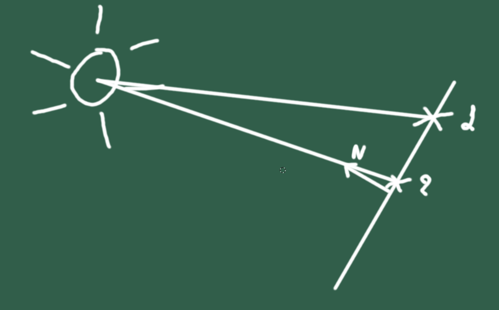

Ignore the vector `N` for a second and notice that it makes sense for point 2 to be brighter than point 1.
That's because point 2 is more in the direction of the light than point 1. How do we implement that?

It's actually easy. Let's see what we have:
- The intersection point.
- The normal of the surface (at the intersection point).
- The origin of the light.

The direction of the light is simple. It is the vector: "origin of the light" - "intersection point" (notice that this
will give us a vector _from_ the intersection point _to_ the light - you can do it in reverse it's just a matter
of preference but whatever you do, be sure that all the vectors in the world follow the same rules).

Notice that we have the normal of the surface at the intersection, which informally is to which direction this
point is "looking". Then, the question becomes: How do we find how much these 2 are aligned?

This is actually the same question as: What is the angle between these 2 vectors?

What tool we have in our hands that contains some measure of the angle? The **dot product**.  
Notice that the dot product is: `a*b = |a|*|b|*cosθ`, where `θ` is the angle between the 2 vectors.  
With the addition that `a` and `b` in our case our unit vetors (they have unit length), we have `a*b = cosθ`.  
Even more importantly, cosine is a function that is inversely proportional to the angle of the 2 vectors. That is,
as the angle increases, the cosine decreases which is exactly what we want. The more the angle increases, the
"darker" we want our point to be.

The code for that is very simple and is kind of like this:
```
V3f light_dir = normalize(light.position - point);
float diffuse_intensity = light.intensity * std::fmax(0.0f, light_dir * normal);
Color result_color = object_color * diffuse_intensity;
```

Now, you can have images like this:

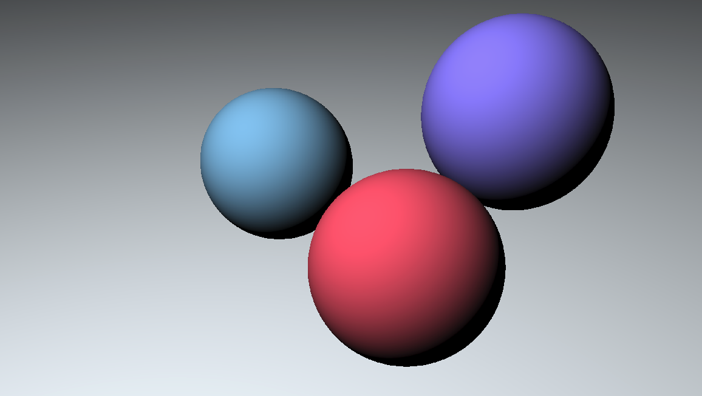

which is quite amazing I think for how little work we put.

Notes:
- The dot product can have negative result so you want to limit it to be greater or equal to 0.
- The direction at which you're looking at the object does not affect at all the lighting. This makes
sense both in the actual world and because our computations did not involve the ray at all. You can
also move the camera around to check it.
- For multiple lights, you want to sum up the diffuse intensities like this:
```
float diffuse_intensity = 0.0f;
for each light:
    V3f light_dir = normalize(light.position - point);
    diffuse_intensity += light.intensity * std::fmax(0.0f, light_dir * normal);
Color result_color = object_color * diffuse_intensity;
```

### Some more shadows

We can make it a little bit more cheesy by adding more shadows than the ones given by the diffuse reflection.
The simple idea we'll use is that we want to skip a light source if there's an interleaving object
from the light source to the intersection point.

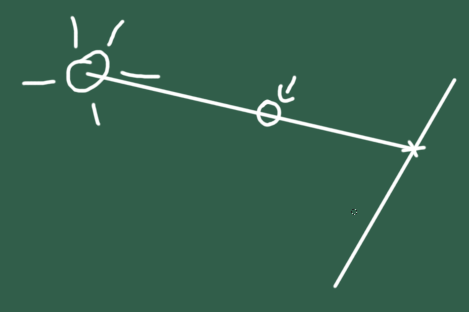

You should be able to do that without looking at any code. Pretty much, we want to know if the light ray
intersects with any object in the world. I mean... We already have a way to check if a ray intersects with the world. :)

Note some things though:

- You want to make a ray _from_ the intersection point _to_ the light source rather than the opposite. The reason
for that is that if you do the reverse, it will definitely intersect (with positive intersection distance)
with the object itself.
- Second, you don't want the ray to start at the intersection point. That's because if you do that, the ray
will intersect with the object itself. So, you can move it a little bit (like, by `0.0001f`) towards the light
source (i.e. in the light direction).

Results:

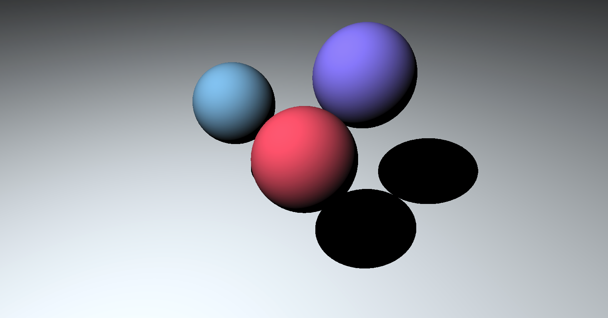

### The Phong Reflection Model

The Phong Reflection Model was invented by [Bui Tuong Phong](https://en.wikipedia.org/wiki/Bui_Tuong_Phong)
and it's a little more complicated than what I'll describe here. I really like
[this article](https://www.scratchapixel.com/lessons/3d-basic-rendering/phong-shader-BRDF/phong-illumination-models-brdf)
if you want to learn more.

So, the Phong reflection model pretty much adds specular light into the equation. This is the "glossy" reflection
of objects, like the white dot here:

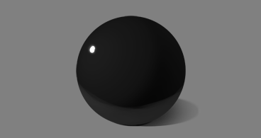

This is the effect of a _light ray_ being incident with the _view direction_ (if you saw this effect in the physical world, 
it would happen because your eyes are in the direction of the reflection of some light rays
with the ball). Note that of course, this **is**
relative to the view direction. If you were to move this camera around, the "specular spots" would change place.

So, to apply that, all we need to do is to figure out how much the _reflection_ of the light direction and
the camera ray (which is the view direction) are aligned. We will use the same dot product trick
here but we have to learn how to compute the reflection.

#### Computing the reflection of a vector

First of all, we should note that a reflection of a vector is computed relative to some _other_ vector,
which we usually call a normal. In our case, it's definitely the normal of the surface at the intersection point.

We'll consider the case of 2 dimensions but the same ideas apply in 3 dimensions as well. Check the image below:

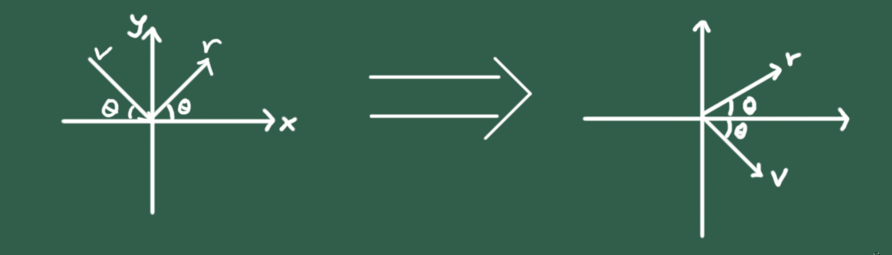

Here, we want to reflect the `v` vector with the result being the `r` vector. In the image to the right
I have just put the `v` vector at the origin. Our normal here is the +y axis.

Well, this is not difficult at all isn't it? If `v` has coordinates `(x, y)`, then `r` has coordinates `(x, -y)`.
So, we just negate the `y` coordinate and we're done. Well.. note quite yet.

This works only when the normal is the +y axis. What about a case like this?

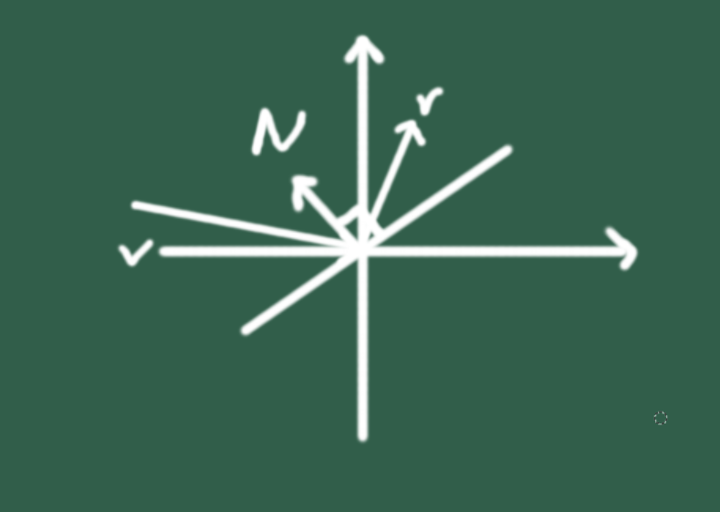

Now, things are not quite as easy. There are multiple ways to find a correct way to reflect a vector
in the general case. One way is by using pure math and solving for `r`, something you can see
[here](https://www.fabrizioduroni.it/2017/08/25/how-to-calculate-reflection-vector.html).

Such solutions are not my cup of tea though so let's go for a more intuitive one.  
Let's start with a simple observation: In the case where the normal is the +y axis, negating
the `y` coordinate is the same as doing `v - 2 * ((v.(0, 1) * (0, 1))`. I know that looks complicated but it's
actually quite simple.

Firstly, `v.(0, 1)` is the dot product of v with the +y axis. This effectively will give us the `y` coordinate
of `v` (which will be negative of course). Then, we multiply that with the vector `(0, 1`). That will give us
a vector "looking" to the -y axis with length equal to the `y` coordinate of `v`. I'll name this `w`.
And finally, we subtract 2 `w`s from `v`. Wait a second, what?

Let's try to only subtract one `w` from `v`. If `v` is `(x, y)` then `w` is `(0, y)` (remember, same length as
the `y` coordinate of `v` and looking directly into the -y axis). So, we have `(x, y) - (0, y)` which
is of course: `(x, 0)`.

What we did is we "cleared" the `y` coordinate. If we subtract another `w`, we'll just get exactly the reflection
vector because we'll "clear" another `y` coordinate which effectively creates a mirror effect.

Now, to generalize, notice that what we did had nothing special to do with the normal `(0, 1)`. Negating the `y`
had but what we did **not**. That is, we can just do the same thing for _any_ normal.

I like to think of it another way as well, but you may want to skip it as it might not help much.
It's essentially by expressing the `v` vector in a differently coordinate system. That which has as "y axis"
the normal. If we do that, we can just negate the `y` coordinate again but because we're not in the standard
coordinate system, the negation is more complicated - it's actually what we did above.

So, anyway, all in all our formula is: `r = v - 2*(v.normal)*normal`.

---

Now that you have a way to compute the reflection vector, doing the specular effect is as simple as computing
the dot product of the reflection vector with the (camera) ray direction.

Notes:
- To fully implement the Phong model, we have to start thinking in terms of materials and not colors.
Then, a material, except for its color, can have additional properties like the diffuse_contribution
and specular_contribution (which are kind of opposite as we have seen).
- We also have to consider the **specular exponent**. In the Phong model, the dot product we compute
is raised to a power which the bigger it is, the smaller and more shiny the spots are (and conversely).
This is because with a small exponent, the function has a "slow fall". Check the image from the link
I posted above:


**Results**:

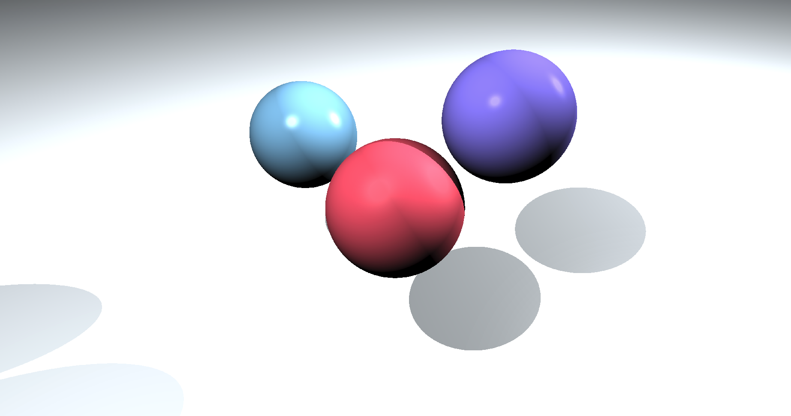

### More Reflections

We already saw how to do one simple reflection which is the glossy highlights. Now, we want to add more
"realistic" reflections which is we want after we hit a point, continue casting the ray into the world.

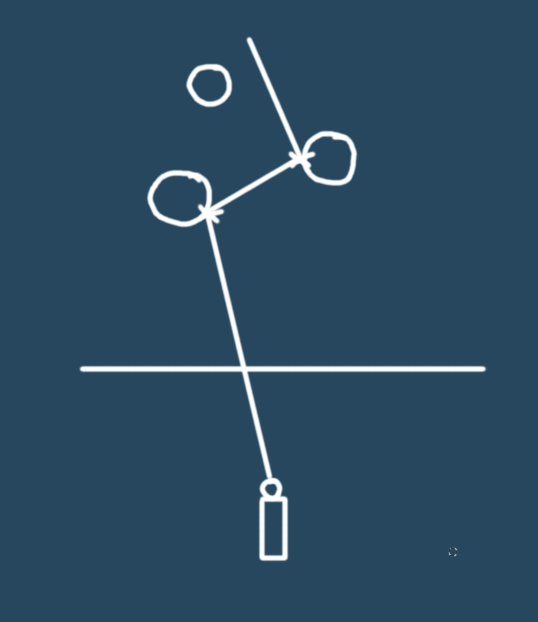

You see the ray hits a point but then continues in the direction of the reflection vector of the normal.
The reflection of the ray direction is computed the same way as we computed the reflection of the light direction.

Now to implement this, the easy and obvious way is to do make a ray from the reflection vector and intersection point and just do  a recursive call. That's what I did and it's actually very simple, we just have to limit the depth of the recursion so that it doesn't recurse forever.

Maybe there exists a way without recursion by just going forwards but I don't know. The problem is that of course
this recursion is not a tail recursion (when we get the returned value, we do something with it),
so I don't see an easy way of converting it to a loop.

That's about it really, by adding another factor to the material, which is its reflectance, you can now
create beautiful reflections, mirrors etc. and get the image at the start of this readme.

You can add more stuff to it like other shapes or whatever you want. You can also start doing work
to make it more realistic (at this point you may want to search the term "Global Illumination")
which is an interesting path I guess and a lot of literature has been written about it.

## Multi-threading

Let's multi-thread it because it's both easy and fun. I should mention that I used **POSIX Threads**. You
may want to try `std::thread` to be platform-independent.

Ok, to multi-thread something, I suggest that you start by making the code "multi-threadable" if there's such
a word before you actually make it as such. This will just make your life easier and it will help you catch
errors early.

So, I started by creating the `render_tile()` function. This gets a `void*` because that's the prototype that
`pthread_create()` wants but you can try making it more understandable at the start. When I first created it,
it took what `render_world()` gets plus a `ymin, ymax, xmin, xmax`. Effectively, that function renders a part
of the world. The rest of the body stayed the same.

Once this works, you can start creating threads which execute `render_tile()` on different parts of the image.

### Dependencies

Notice a very important thing: There are **no dependencies** between the threads. That is, to compute a part
of the image, you don't need any other part of the image. This is what makes multi-threading so easy.

Just to give you an example, consider an operation on images which is called image convolution. In this, for
every pixel, you take the 9 surrounding pixel and do something with them (it doesn't matter what you do for this example).
Also consider that every thread has access only to _its_ original part of the image (like, the upper right half).
But if you split the image in multiple threads, in the edges, one thread will need info from another thread
and in short... things get rough (you have to exchange data between the threads or processes).
If you're interested in the topic, you can check another project of mine:
[2D Image Convolution MPI/SIMD](https://github.com/baziotis/2D-Image-Convolution-MPI-SIMD)

### Splitting and Work Balance

Now, it is interesting to think about how do we split the image. In other words, what part of the image gets
every thread. There are 2 relatively obvious ways that come into my mind:
#### Split in one dimension (i.e. slices)


#### Split in two dimensions (i.e. rectangles / squares)


The other thing to consider is the balancing of work. That is, for example one way to go is let's say
we split in 2 dimensions and we have 4 threads.

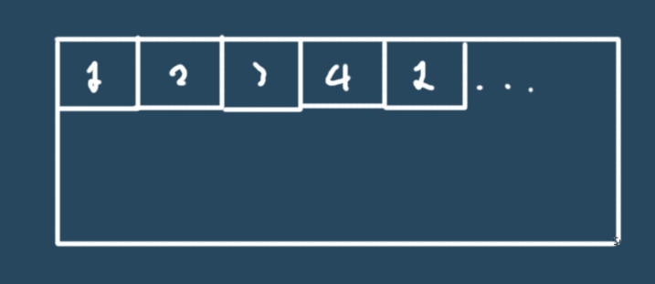

We split the image in small tiles (like let's say 64x64) and then we put them e.g. in a work queue. Then, threads
pick a tile, fisish with it and get a new tile from the queue (For example in the image, thread 1 got the first
tile, thread 2 the second etc. then thread 1 the 5th and so on).

Another way to go about is to say ok, how many threads do we have ? 4. Ok, split the image in 4 big equal chunks
(again, either in one dimension or in 2) and give one to each thread. No work queues, no nothing.

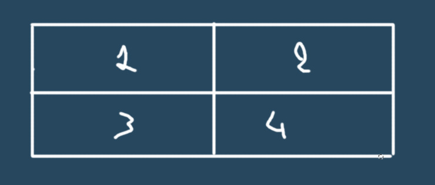

Note: Splitting in 4 is always easy (well, assuming the width and the height are multiples of 2, which almost always
are) because the chunks have a height = image_height / 2 and width = image_width / 2.  
But, splitting in 8 is more difficult because sqrt(8) is not an integer. So, you have to find the best divisors.
In the case of 8 for example, one way is: height = image_height / 4, width = image_width / 2  
Another is: height = image_height / 2, width = image_width / 4

---

What is better depends on the situation. Let's start with the easier decision, which is whether to split in one
or two dimensions. The work we do is strictly linear - we go from one pixel to the next only writing in memory
and as far as the world is concerned, we only read from it.
So, from a cache point of view, it makes sense that split only in the height because that will give us better locality.

If we split in 2 dimensions, we'll get more cache misses because imagine that we could just continue processing
forward (in memory) but since we split in 2, we may jump to the next row of pixels. But the next row may be very
far from memory. That's especially worse if we choose to render in small tiles in which we will jump rows often
because our rows are small.

About the second decision, to be honest, I didn't give much thought into it. Neither did I do any experimentation.  
For one, it seems that if our tiles are very small, we may have [false-sharing](https://en.wikipedia.org/wiki/False_sharing).

On the other hand, splitting e.g. in 4 big chunks may result in bad balancing because imagine that a part of
an image has no objects. That thread will finish very early and then it'll have nothing to do.  

I'd say that the best way to go is to only split in height and also render in small slices rather than big ones
to get better balancing. But I was just bored to make a queue...
